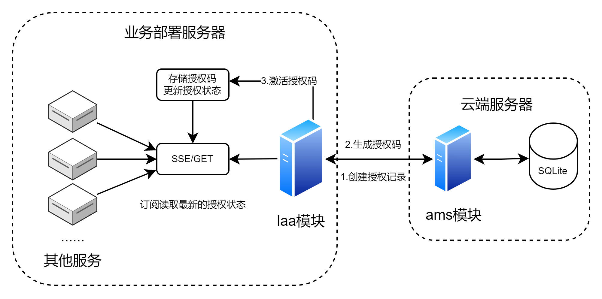
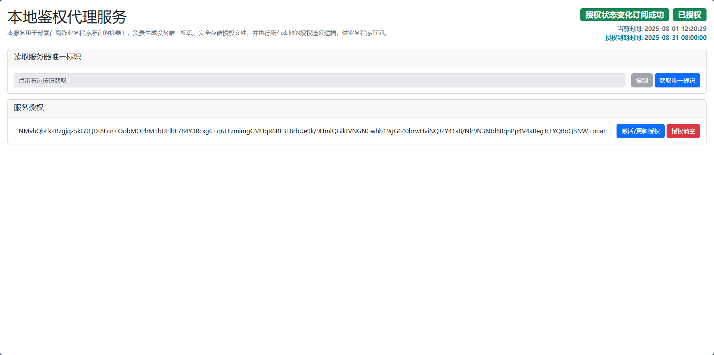
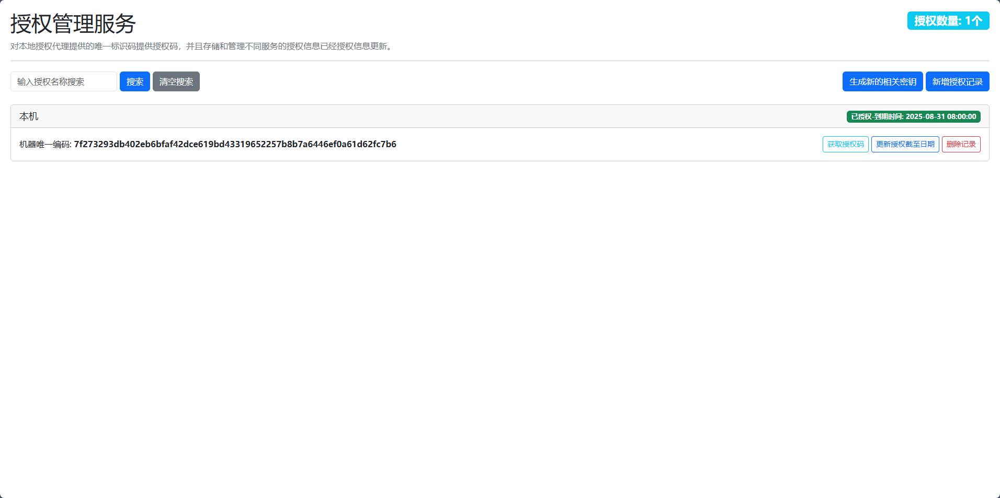

# 离线授权平台

这是一个由两个独立模块构成的授权平台，旨在为服务提供安全、灵活的授权管理功能。整个系统分为两个核心组件：部署在业务本地服务器上的本地授权代理（LAA）和部署在云端的授权管理服务（AMS）。

## 一、系统架构概览
* 本地授权代理 (LAA)：部署在每个需要授权的服务机器上。它负责生成服务器设备的唯一标识、存储和验证授权码，并提供API给业务服务感知实时的授权状态

* 授权管理服务 (AMS)：用于集中管理所有授权记录。它用于创建、查询和更新授权时间并生成授权码。

## 模块概述
详细模块文档说明请查看模块中的`README.md`文件
### 本地授权代理 (LAA) 模块

**主要功能**

* 设备唯一标识：为每台设备生成专属标识，确保授权码的设备绑定。
* 授权验证：使用 RSA 签名和 AES 加密技术，验证授权码的真实性和完整性，防止篡改。
* 授权有效期控制：根据授权码中的到期时间实时检测授权码的到期时间，并及时通知业务服务。
* API 接口：提供 HTTP 和 SSE（Server-Send Events）接口，允许业务程序实时获取授权状态（如“未授权”、“已授权”、“授权过期”）和到期时间。
* WebGUI：提供一个简单的网页界面，用于获取机器码和激活授权码以及观测授权变化。

**平台支持**

目前仅支持 Windows 其他平台的设备码读取功能正在适配中。

**模块使用**
1. 配置密钥：如果你需要自定义密钥，可以在 model/constant.go 文件中配置 AES 密钥和 RSA 公钥。这些密钥必须与 AMS 模块中的密钥配对。
2. 构建程序：使用 go build 命令构建可执行文件。
3. 启动服务：程序启动后，默认监听 localhost:1022 端口，可通过`localhost:1022/`访问WebGUI。
4. 状态接入： 通过/status 接口查询授权状态或使用 /status/subscribe 接口订阅授权状态变化。

**请查看 [laa/README.md文档](https://github.com/setruth/authorization/blob/master/laa/README.md) 获取详细方式**

### 授权管理服务 (AMS) 模块

**主要功能**

* 授权记录管理：支持对授权记录进行增、删、改、查。
* 授权码生成：根据设备标识和到期时间，生成加密且带签名的授权码。
* 密钥生成：提供系统自定义时所需要的密钥生成。
* WebGUI：提供一个可视化的管理界面，方便管理所有授权设备。
* 持久化存储：使用 SQLite 数据库存储所有授权记录，确保数据持久性。

**平台支持**

无特定平台的功能，支持所有平台编译使用

**模块使用**

1. 配置密钥：同样，如果你需要自定义密钥，需要在 model/constant.go 中设置 AES 密钥，同时将 RSA 私钥配置到部署环境的环境变量中。
2. 构建程序：使用 go build 命令为所需的平台编译可执行文件。由于 AMS 不涉及平台特定的功能，它能轻松适配 Windows、MacOS 和 Linux。=
3. 启动服务：服务默认监听 localhost:1023 端口，通过 localhost:1023/web 地址访问 WebGUI 进行管理。

**请查看 [ams/README.md文档](https://github.com/setruth/authorization/blob/master/ams/README.md) 获取详细方式**
## 未来计划

- [ ] 适配全平台的设备码读取
- [ ] 提供多种时间检查方式

## 授权平台结构图及WebGUI预览
**整体结构图**

**laa-WebGUI预览**

**ams-WebGUI预览**
